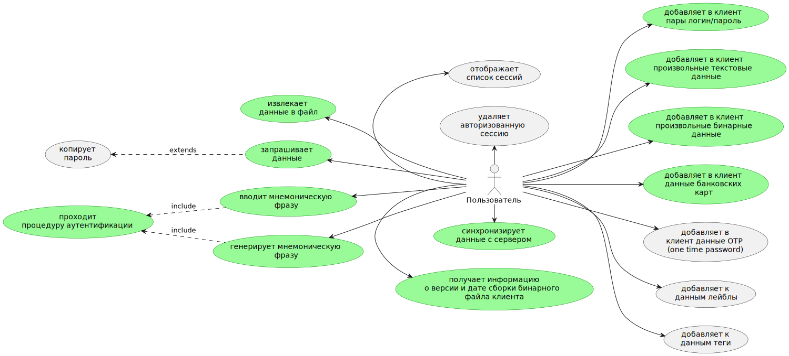

# Менеджер паролей GophKeeper

[](https://github.com/gopherlearning/gophkeeper/actions?workflow=run%20tests)
[](https://github.com/gopherlearning/gophkeeper/actions?workflow=Upload%20release%20assets%20after%20tagging)
[](https://coveralls.io/github/gopherlearning/gophkeeper)
[](https://goreportcard.com/report/github.com/gopherlearning/gophkeeper) 

## Общие требования
GophKeeper представляет собой клиент-серверную систему, позволяющую пользователю надёжно и безопасно хранить логины, пароли, бинарные данные и прочую приватную информацию.

**Сервер должен реализовывать следующую бизнес-логику:**
* [x] регистрация, аутентификация и авторизация пользователей;
* [x] хранение приватных данных;
* [ ] синхронизация данных между несколькими авторизованными клиентами одного владельца;
* [x] передача приватных данных владельцу по запросу.

**Клиент должен реализовывать следующую бизнес-логику:**
* [x] аутентификация и авторизация пользователей на удалённом сервере;
* [x] доступ к приватным данным по запросу.

**Функции, реализация которых остаётся на усмотрение исполнителя:**
* [x] создание, редактирование и удаление данных на стороне сервера или клиента;
* [x] формат регистрации нового пользователя;
* [x] выбор хранилища и формат хранения данных;
* [ ] обеспечение безопасности передачи и хранения данных;
* [x] протокол взаимодействия клиента и сервера;
* [x] механизмы аутентификации пользователя и авторизации доступа к информации.

**Дополнительные требования:**
* [x] клиент должен распространяться в виде CLI-приложения с возможностью запуска на платформах Windows, Linux и Mac OS;
* [x] клиент должен давать пользователю возможность получить информацию о версии и дате сборки бинарного файла клиента.

### Типы хранимой информации
* [x] пары логин/пароль;
* [x] произвольные текстовые данные;
* [x] произвольные бинарные данные;
* [x] данные банковских карт.

Для любых данных должна быть возможность хранения произвольной текстовой метаинформации (принадлежность данных к веб-сайту, личности или банку, списки одноразовых кодов активации и прочее).

### Абстрактная схема взаимодействия с системой
Ниже описаны базовые сценарии взаимодействия пользователя с системой. Они не являются исчерпывающими — решение отдельных сценариев (например, разрешение конфликтов данных на сервере) остаётся на усмотрение исполнителя.

**Для нового пользователя:**
* [x] пользователь получает клиент под необходимую ему платформу.
* [x] пользователь проходит процедуру первичной регистрации.
* [x] пользователь добавляет в клиент новые данные.
* [x] клиент синхронизирует данные с сервером.

**Для существующего пользователя:**
* [x] пользователь получает клиент под необходимую ему платформу.
* [x] пользователь проходит процедуру аутентификации.
* [x] клиент синхронизирует данные с сервером.
* [x] пользователь запрашивает данные.
* [x] клиент отображает данные для пользователя.

### Тестирование и документация
Код всей системы должен быть покрыт юнит-тестами не менее чем на 80%. Каждая экспортированная функция, тип, переменная, а также пакет системы должны содержать исчерпывающую документацию.

### Необязательные функции
Перечисленные ниже функции необязательны к имплементации, однако позволяют лучше оценить степень экспертизы исполнителя. Исполнитель может реализовать любое количество из представленных ниже функций на свой выбор:
* [ ] поддержка данных типа OTP (one time password);
* [x] поддержка терминального интерфейса (TUI — terminal user interface);
* [x] использование бинарного протокола;
* [x] наличие функциональных и/или интеграционных тестов;
* [ ] описание протокола взаимодействия клиента и сервера в формате Swagger.
* [x] автоматическое проверка покрытия тестами
* [x] автоматическая сборка релиза
* [x] автоматическая сборка Docker образа


## Схемы
### Пользовательские сценарии



### Схема хранения
1. Права:
  * owner   - watch, edit, delete
  * editor  - watch, edit
  * reader  - watch

data:uuid_1 = model.Secret
data:uuid_2 = model.Secret
data:uuid_3 = model.Secret

owner:pubKey_1:uuid_1
owner:pubKey_1:uuid_2
owner:pubKey_2:uuid_3

editor:pubkey_2:uuid_1

reader:pubkey_3:uuid_3


## Проверка покрытия тестами
```bash
go test ./... -coverprofile=profile.cov
go tool cover -func profile.cov

```